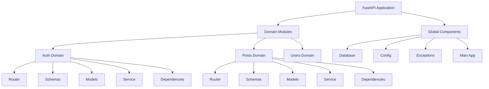
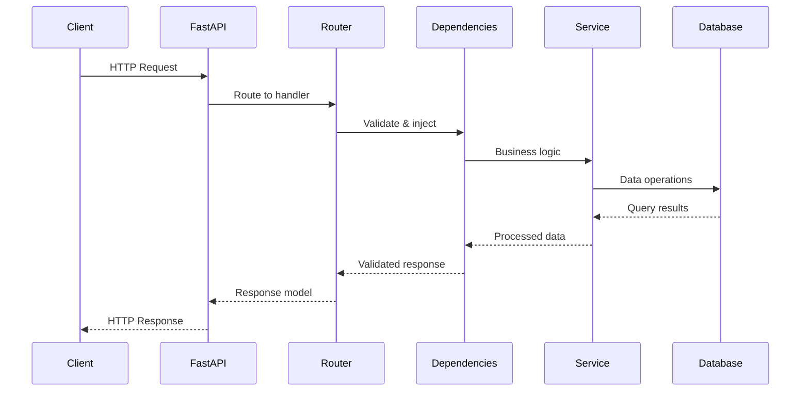
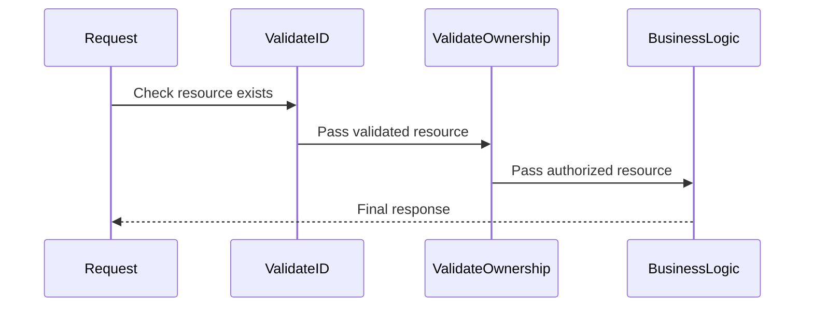

# Design Document: FastAPI Best Practices Template

## Overview

This feature implements a comprehensive FastAPI project template that follows industry best practices for scalable, maintainable web applications. The template provides a domain-driven project structure, proper async/sync handling, robust validation patterns, dependency injection, database conventions, and comprehensive testing setup. It serves as a foundation for building production-ready FastAPI applications with consistent code organization, performance optimization, and development workflow standards.

## Architecture

The system follows a domain-driven architecture where code is organized by business domains rather than technical layers, promoting better maintainability and team collaboration.



## Sequence Diagrams

### Main Application Flow



### Dependency Chain Flow



## Components and Interfaces

### Core Application Component

**Purpose**: Main FastAPI application initialization and configuration

**Interface**:
```python
class FastAPIApp:
    def create_app() -> FastAPI
    def configure_middleware(app: FastAPI) -> None
    def register_routers(app: FastAPI) -> None
    def setup_exception_handlers(app: FastAPI) -> None
```

**Responsibilities**:
- Application lifecycle management
- Middleware configuration
- Router registration
- Global exception handling

### Domain Router Component

**Purpose**: HTTP endpoint definitions for specific business domains

**Interface**:
```python
class DomainRouter:
    router: APIRouter
    
    def get_items(dependencies: Dependencies) -> ResponseModel
    def create_item(data: CreateSchema, dependencies: Dependencies) -> ResponseModel
    def update_item(item_id: UUID, data: UpdateSchema, dependencies: Dependencies) -> ResponseModel
    def delete_item(item_id: UUID, dependencies: Dependencies) -> ResponseModel
```

**Responsibilities**:
- HTTP request/response handling
- Route parameter binding
- Response model serialization

### Service Layer Component

**Purpose**: Business logic implementation and data orchestration

**Interface**:
```python
class DomainService:
    def get_by_id(item_id: UUID) -> Optional[DomainModel]
    def create(data: CreateSchema) -> DomainModel
    def update(item_id: UUID, data: UpdateSchema) -> DomainModel
    def delete(item_id: UUID) -> bool
    def list_with_filters(filters: FilterSchema) -> List[DomainModel]
```

**Responsibilities**:
- Business rule enforcement
- Data transformation
- Cross-domain coordination
- Transaction management

### Dependency Injection Component

**Purpose**: Request validation, authentication, and resource injection

**Interface**:
```python
class DomainDependencies:
    async def validate_resource_id(resource_id: UUID) -> DomainModel
    async def validate_ownership(resource: DomainModel, user: UserModel) -> DomainModel
    async def parse_jwt_token(token: str) -> TokenData
    async def get_current_user(token_data: TokenData) -> UserModel
```

**Responsibilities**:
- Input validation
- Authentication/authorization
- Resource existence verification
- Permission checking

## Data Models

### Base Model Configuration

```python
class BaseModel(PydanticBaseModel):
    model_config = ConfigDict(
        json_encoders={datetime: datetime_to_gmt_str},
        populate_by_name=True,
        validate_assignment=True,
        use_enum_values=True
    )
```

**Validation Rules**:
- All datetime fields serialized to GMT strings
- Field aliases supported for API compatibility
- Runtime validation on assignment
- Enum values automatically converted

### Domain Schema Models

```python
class CreateItemSchema(BaseModel):
    title: str = Field(min_length=1, max_length=200)
    description: Optional[str] = Field(max_length=1000)
    category: CategoryEnum
    tags: List[str] = Field(max_items=10)
    
class UpdateItemSchema(BaseModel):
    title: Optional[str] = Field(min_length=1, max_length=200)
    description: Optional[str] = Field(max_length=1000)
    category: Optional[CategoryEnum]
    tags: Optional[List[str]] = Field(max_items=10)

class ItemResponseSchema(BaseModel):
    id: UUID4
    title: str
    description: Optional[str]
    category: CategoryEnum
    tags: List[str]
    created_at: datetime
    updated_at: datetime
    owner_id: UUID4
```

**Validation Rules**:
- String fields have length constraints
- Optional fields allow partial updates
- Enum validation for categorical data
- List fields have size limits
- UUID validation for identifiers

### Database Model

```python
class ItemModel(SQLAlchemyBase):
    __tablename__ = "item"
    
    id: Mapped[UUID] = mapped_column(UUID(as_uuid=True), primary_key=True, default=uuid4)
    title: Mapped[str] = mapped_column(String(200), nullable=False, index=True)
    description: Mapped[Optional[str]] = mapped_column(Text)
    category: Mapped[str] = mapped_column(String(50), nullable=False, index=True)
    tags: Mapped[List[str]] = mapped_column(JSON)
    created_at: Mapped[datetime] = mapped_column(DateTime(timezone=True), default=func.now())
    updated_at: Mapped[datetime] = mapped_column(DateTime(timezone=True), default=func.now(), onupdate=func.now())
    owner_id: Mapped[UUID] = mapped_column(UUID(as_uuid=True), ForeignKey("user.id"), nullable=False)
```

**Validation Rules**:
- Primary key auto-generation
- Required fields marked as non-nullable
- Indexed fields for query performance
- Timestamp fields with timezone awareness
- Foreign key relationships enforced

## Algorithmic Pseudocode

### Main Application Initialization Algorithm

```pascal
ALGORITHM initializeApplication()
INPUT: configuration settings
OUTPUT: configured FastAPI application

BEGIN
  ASSERT configuration is valid AND all required settings present
  
  // Step 1: Create base application
  app ← createFastAPIApp(configuration)
  
  // Step 2: Configure middleware with order preservation
  middlewareStack ← []
  FOR each middleware IN requiredMiddleware DO
    ASSERT middleware.isCompatible(app.version)
    middlewareStack.append(middleware)
  END FOR
  
  applyMiddleware(app, middlewareStack)
  
  // Step 3: Register domain routers
  FOR each domain IN availableDomains DO
    router ← domain.getRouter()
    ASSERT router.isValid() AND router.hasRequiredEndpoints()
    app.include_router(router, prefix=domain.prefix, tags=domain.tags)
  END FOR
  
  // Step 4: Setup global exception handlers
  setupExceptionHandlers(app)
  
  ASSERT app.isFullyConfigured() AND app.canHandleRequests()
  
  RETURN app
END
```

**Preconditions:**
- Configuration object contains all required settings
- Database connection is available
- All domain modules are properly structured
- Required dependencies are installed

**Postconditions:**
- FastAPI application is fully configured
- All routes are registered and accessible
- Middleware stack is properly ordered
- Exception handlers are active

**Loop Invariants:**
- All processed middleware maintain compatibility
- All registered routers have valid configurations
- Application state remains consistent throughout initialization

### Request Processing Algorithm

```pascal
ALGORITHM processRequest(request)
INPUT: HTTP request object
OUTPUT: HTTP response object

BEGIN
  ASSERT request is well-formed AND has required headers
  
  // Step 1: Route matching and parameter extraction
  route ← findMatchingRoute(request.path, request.method)
  IF route = NULL THEN
    RETURN HTTPException(404, "Route not found")
  END IF
  
  parameters ← extractPathParameters(request, route)
  
  // Step 2: Dependency resolution with caching
  resolvedDependencies ← {}
  FOR each dependency IN route.dependencies DO
    ASSERT allDependenciesResolvable(dependency.requirements)
    
    IF dependency NOT IN resolvedDependencies THEN
      result ← resolveDependency(dependency, request, parameters)
      resolvedDependencies[dependency] ← result
    END IF
  END FOR
  
  // Step 3: Execute route handler
  response ← executeRouteHandler(route.handler, parameters, resolvedDependencies)
  
  // Step 4: Serialize response
  serializedResponse ← serializeResponse(response, route.responseModel)
  
  ASSERT serializedResponse.isValid() AND serializedResponse.matchesSchema()
  
  RETURN serializedResponse
END
```

**Preconditions:**
- Request object is properly formatted HTTP request
- Application is fully initialized and running
- Database connections are available
- All required dependencies are resolvable

**Postconditions:**
- Response matches the declared response model
- All side effects are properly committed or rolled back
- Request processing metrics are recorded
- No resource leaks occur

**Loop Invariants:**
- All resolved dependencies remain valid throughout request processing
- Dependency resolution cache maintains consistency
- No circular dependencies are encountered

### Dependency Validation Algorithm

```pascal
ALGORITHM validateDependency(dependency, request, context)
INPUT: dependency definition, HTTP request, execution context
OUTPUT: validated dependency result

BEGIN
  ASSERT dependency.isWellDefined() AND context.isValid()
  
  // Step 1: Extract dependency parameters
  parameters ← extractParameters(dependency, request)
  
  // Step 2: Validate each parameter with early termination
  FOR each parameter IN parameters DO
    IF NOT validateParameter(parameter, dependency.schema) THEN
      RETURN ValidationError(parameter.name, parameter.value)
    END IF
  END FOR
  
  // Step 3: Execute dependency logic
  IF dependency.requiresAsyncExecution() THEN
    result ← AWAIT executeDependencyAsync(dependency, parameters, context)
  ELSE
    result ← executeDependencySync(dependency, parameters, context)
  END IF
  
  // Step 4: Validate result
  IF NOT validateResult(result, dependency.returnType) THEN
    RETURN InternalError("Dependency returned invalid result")
  END IF
  
  ASSERT result.isValid() AND result.matchesExpectedType()
  
  RETURN result
END
```

**Preconditions:**
- Dependency is properly defined with valid schema
- Request contains all required parameters
- Execution context has necessary permissions
- Database connections are available if needed

**Postconditions:**
- Result matches dependency's declared return type
- All validation rules are satisfied
- Side effects are properly managed
- Error states are clearly communicated

**Loop Invariants:**
- All validated parameters remain valid throughout execution
- Parameter validation state is consistent
- No invalid parameters proceed to execution phase

## Key Functions with Formal Specifications

### Function 1: createDomainRouter()

```python
def createDomainRouter(domain_config: DomainConfig) -> APIRouter
```

**Preconditions:**
- `domain_config` is non-null and contains valid domain definition
- `domain_config.prefix` is a valid URL path prefix
- `domain_config.handlers` contains at least one valid route handler
- All handler dependencies are resolvable

**Postconditions:**
- Returns configured APIRouter instance
- Router contains all specified routes with correct HTTP methods
- All route dependencies are properly registered
- Router prefix and tags are correctly set
- No duplicate route paths exist within the router

**Loop Invariants:** N/A (no loops in this function)

### Function 2: validateResourceAccess()

```python
async def validateResourceAccess(resource_id: UUID, user: UserModel, permission: Permission) -> ResourceModel
```

**Preconditions:**
- `resource_id` is a valid UUID
- `user` is authenticated and has valid user model
- `permission` is a valid permission enum value
- Database connection is available

**Postconditions:**
- Returns resource model if access is granted
- Raises PermissionDenied exception if access is denied
- Raises ResourceNotFound exception if resource doesn't exist
- No side effects on user or resource state
- Database queries are properly closed

**Loop Invariants:** N/A (no loops in this function)

### Function 3: processAsyncRoute()

```python
async def processAsyncRoute(handler: Callable, dependencies: Dict[str, Any], request_data: Any) -> ResponseModel
```

**Preconditions:**
- `handler` is a valid async callable
- `dependencies` contains all required dependency values
- `request_data` matches handler's expected input schema
- All async dependencies have been resolved

**Postconditions:**
- Returns response model matching handler's declared return type
- All async operations are properly awaited
- Database transactions are committed or rolled back appropriately
- No blocking operations are performed in async context
- Resource cleanup is performed regardless of success/failure

**Loop Invariants:** N/A (no loops in this function)

## Example Usage

```python
# Example 1: Basic domain router setup
from src.auth.router import router as auth_router
from src.posts.router import router as posts_router

app = FastAPI(title="Best Practices API")
app.include_router(auth_router, prefix="/auth", tags=["Authentication"])
app.include_router(posts_router, prefix="/posts", tags=["Posts"])

# Example 2: Dependency chain usage
@router.get("/posts/{post_id}")
async def get_post(
    post: PostModel = Depends(validate_post_exists),
    user: UserModel = Depends(get_current_user)
):
    return PostResponseSchema.from_orm(post)

@router.put("/posts/{post_id}")
async def update_post(
    post_data: UpdatePostSchema,
    post: PostModel = Depends(validate_post_ownership),  # Chains validate_post_exists
    user: UserModel = Depends(get_current_user)
):
    updated_post = await post_service.update(post.id, post_data)
    return PostResponseSchema.from_orm(updated_post)

# Example 3: Async/sync route handling
@router.get("/sync-operation")
def sync_route():
    # Blocking I/O runs in threadpool automatically
    result = blocking_external_api_call()
    return {"result": result}

@router.get("/async-operation")
async def async_route():
    # Non-blocking I/O using await
    result = await async_database_query()
    return {"result": result}

# Example 4: Custom validation dependency
async def validate_post_ownership(
    post: PostModel = Depends(validate_post_exists),
    user: UserModel = Depends(get_current_user)
) -> PostModel:
    if post.owner_id != user.id:
        raise HTTPException(status_code=403, detail="Not authorized to access this post")
    return post
```

## Correctness Properties

### Universal Quantification Statements

**Property 1: Route Registration Completeness**
```
∀ domain ∈ RegisteredDomains : 
  domain.router.isRegistered() ∧ 
  domain.router.hasValidPrefix() ∧
  ∀ route ∈ domain.router.routes : route.hasValidHandler()
```

**Property 2: Dependency Resolution Consistency**
```
∀ request ∈ IncomingRequests :
  ∀ dependency ∈ request.route.dependencies :
    resolveDependency(dependency, request) = resolveDependency(dependency, request)
    (Dependencies are deterministic and cacheable per request)
```

**Property 3: Async/Sync Route Correctness**
```
∀ route ∈ AsyncRoutes :
  ∀ operation ∈ route.operations :
    operation.isNonBlocking() ∨ operation.usesThreadpool()
    
∀ route ∈ SyncRoutes :
  route.executesInThreadpool() = true
```

**Property 4: Validation Completeness**
```
∀ schema ∈ PydanticSchemas :
  ∀ field ∈ schema.fields :
    field.hasValidationRules() ∧ field.hasTypeAnnotation()
    
∀ request ∈ IncomingRequests :
  validateRequest(request) = true ⟹ request.matchesExpectedSchema()
```

**Property 5: Database Naming Convention Compliance**
```
∀ table ∈ DatabaseTables :
  table.name.isSnakeCase() ∧ table.name.isSingular()
  
∀ column ∈ table.columns :
  (column.isDateTime() ⟹ column.name.endsWith("_at")) ∧
  (column.isDate() ⟹ column.name.endsWith("_date"))
```

## Error Handling

### Error Scenario 1: Invalid Route Parameters

**Condition**: Client sends request with malformed UUID or missing required parameters
**Response**: Return 422 Unprocessable Entity with detailed validation errors
**Recovery**: Client corrects parameters and retries request

### Error Scenario 2: Database Connection Failure

**Condition**: Database becomes unavailable during request processing
**Response**: Return 503 Service Unavailable with retry-after header
**Recovery**: Implement connection pooling with automatic retry and circuit breaker pattern

### Error Scenario 3: Dependency Resolution Failure

**Condition**: Required dependency cannot be resolved (e.g., user not found, resource access denied)
**Response**: Return appropriate HTTP status (401, 403, 404) with descriptive error message
**Recovery**: Log error details for monitoring, return user-friendly error response

### Error Scenario 4: Async Operation Timeout

**Condition**: Async database query or external API call exceeds timeout threshold
**Response**: Return 504 Gateway Timeout with operation context
**Recovery**: Cancel pending operations, release resources, log timeout for analysis

## Testing Strategy

### Unit Testing Approach

Comprehensive unit testing for each component with focus on business logic isolation, dependency mocking, and edge case coverage. Target 90%+ code coverage with emphasis on critical paths and error conditions.

**Key Test Categories**:
- Schema validation with valid/invalid inputs
- Service layer business logic with mocked dependencies
- Dependency injection with various authentication states
- Database model relationships and constraints

### Property-Based Testing Approach

Use property-based testing to verify system invariants and catch edge cases that traditional example-based tests might miss.

**Property Test Library**: hypothesis (Python)

**Key Properties to Test**:
- Schema serialization/deserialization roundtrip consistency
- Database query result consistency across different filter combinations
- Authentication token generation and validation symmetry
- API response format consistency across all endpoints

**Example Property Tests**:
```python
@given(valid_user_data())
def test_user_schema_roundtrip(user_data):
    schema = UserCreateSchema(**user_data)
    serialized = schema.model_dump()
    deserialized = UserCreateSchema(**serialized)
    assert schema == deserialized

@given(valid_post_filters())
def test_post_filtering_consistency(filters):
    results1 = post_service.list_with_filters(filters)
    results2 = post_service.list_with_filters(filters)
    assert results1 == results2  # Deterministic results
```

### Integration Testing Approach

End-to-end testing using async test client to verify complete request/response cycles, database interactions, and cross-domain functionality.

**Test Categories**:
- Authentication flow with JWT token lifecycle
- CRUD operations with database persistence verification
- Cross-domain operations (e.g., user creating posts)
- Error handling and edge cases in realistic scenarios

## Performance Considerations

**Async/Sync Optimization**: Proper separation of blocking and non-blocking operations to maximize FastAPI's async performance benefits. Use threadpool for CPU-intensive tasks and sync database operations.

**Database Query Optimization**: Implement proper indexing strategy, use SQL-first approach for complex queries, and leverage database-level JSON aggregation for nested responses.

**Dependency Caching**: FastAPI's built-in dependency caching per request reduces redundant computations and database queries within single request lifecycle.

**Connection Pooling**: Configure appropriate database connection pool sizes based on expected concurrent load and database capacity.

## Security Considerations

**Authentication & Authorization**: JWT-based authentication with proper token validation, expiration handling, and role-based access control through dependency injection.

**Input Validation**: Comprehensive Pydantic schema validation for all inputs, with proper sanitization and constraint enforcement to prevent injection attacks.

**Database Security**: Use parameterized queries through SQLAlchemy ORM, implement proper foreign key constraints, and follow principle of least privilege for database access.

**API Documentation Security**: Hide OpenAPI documentation in production environments to prevent information disclosure about internal API structure.

## Dependencies

**Core Framework**:
- FastAPI (latest stable version)
- Uvicorn (ASGI server)
- Pydantic (data validation)

**Database**:
- SQLAlchemy (ORM)
- Alembic (migrations)
- asyncpg or psycopg2 (PostgreSQL driver)

**Authentication**:
- python-jose (JWT handling)
- passlib (password hashing)
- python-multipart (form data)

**Testing**:
- pytest (test framework)
- pytest-asyncio (async test support)
- httpx (async HTTP client)
- hypothesis (property-based testing)

**Development Tools**:
- ruff (linting and formatting)
- mypy (type checking)
- pre-commit (git hooks)